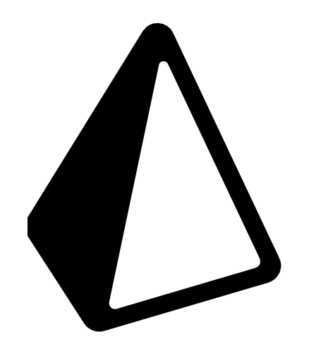
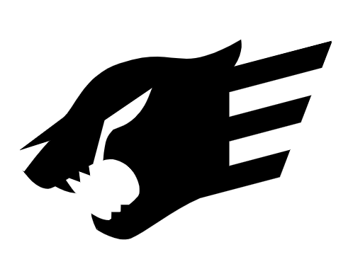
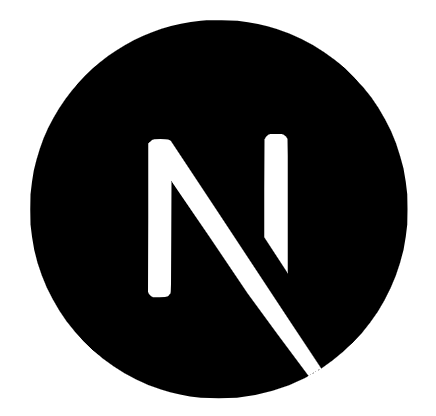
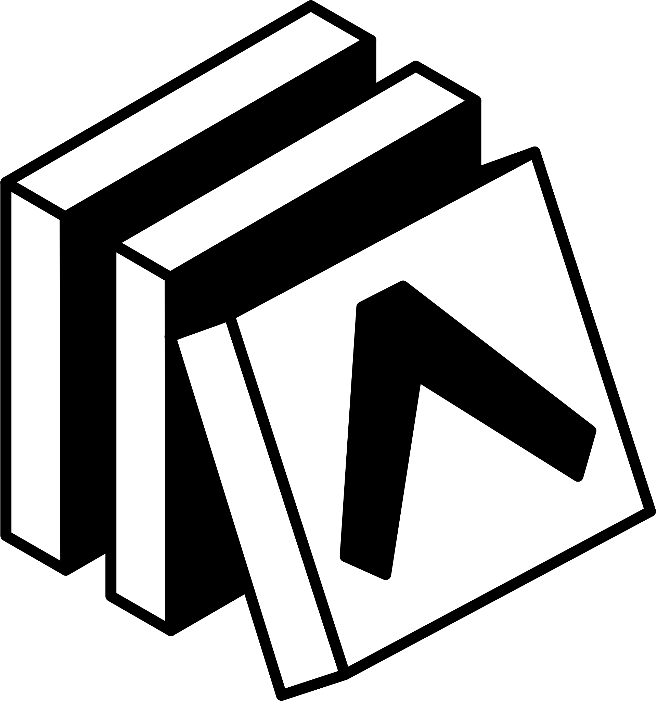

## Hi there 👋

- based in Vienna 🎡
- I enjoy untangling code puzzles and turning tech challenges into exciting journeys of discovery. 🧩
- I am currently developing with TypeScript, Node.js, PostgreSQL, React Native/Expo & Next.js, but always eagler to learn something new! 💡

### My tech stack

                     

### Connect with me 📞

<!--
**juditla/juditla** is a ✨ _special_ ✨ repository because its `README.md` (this file) appears on your GitHub profile.

Here are some ideas to get you started:

- 🔭 I’m currently working on ...
- 🌱 I’m currently learning ...
- 👯 I’m looking to collaborate on ...
- 🤔 I’m looking for help with ...
- 💬 Ask me about ...
- 📫 How to reach me: ...
- 😄 Pronouns: ...
- ⚡ Fun fact: ...
-->
